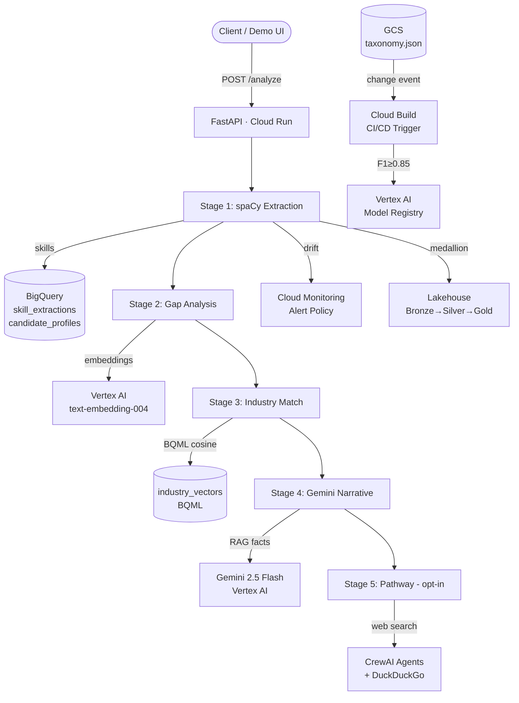

# ReSkillio

**AI-powered career rebound platform** — upload a resume, get a complete career intelligence report: extracted skills, gap analysis vs a target job, industry fit scores, a Gemini-written narrative, and an optional 90-day reskilling roadmap.

Built on **Google Cloud** (BigQuery, Vertex AI, Gemini, Cloud Monitoring, Cloud Build) with a **FastAPI** REST API, **spaCy** NLP, **LangGraph** and **CrewAI** agents, and a **BigQuery medallion lakehouse**.

---

## Live Demo

```bash
curl -X POST https://<YOUR_CLOUD_RUN_URL>/analyze \
  -F "resume=@resume.pdf" \
  -F "target_role=Senior Data Engineer" \
  -F "jd_text=We need Python, BigQuery, Airflow, dbt, Spark..." \
  -F "candidate_id=demo-001"
```

[Full API docs →](#api-reference) | [Sample output →](#sample-output) | [Architecture →](#system-architecture)

---

## Table of Contents

1. [What It Does](#what-it-does)
2. [System Architecture](#system-architecture)
3. [GCP Service Map](#gcp-service-map)
4. [API Reference](#api-reference)
5. [Data Pipeline](#data-pipeline)
6. [Agents](#agents)
7. [BigQuery Lakehouse](#bigquery-lakehouse)
8. [CI/CD & Model Registry](#cicd--model-registry)
9. [Drift Monitoring](#drift-monitoring)
10. [Sample Output](#sample-output)
11. [Getting Started](#getting-started)
12. [Configuration](#configuration)
13. [Project Structure](#project-structure)

---

## What It Does

| Stage | What happens | GCP service |
|-------|-------------|-------------|
| **1. Extract** | spaCy PhraseMatcher + NER pulls 200+ skills from resume text | BigQuery |
| **2. Gap Analysis** | Exact match + semantic similarity vs JD requirements; gap score 0–100 | Vertex AI Embeddings |
| **3. Industry Match** | BQML cosine distance against 8 industry centroid vectors | BigQuery ML |
| **4. Narrative** | Gemini RAG-grounded 3-sentence career story, no hallucinations | Vertex AI Gemini |
| **5. Pathway** | CrewAI two-agent crew researches courses + builds 90-day roadmap | Gemini + DuckDuckGo |

All five stages run in a single `POST /analyze` call. Each stage is fail-safe — a downstream failure never blocks results already produced.

---

## System Architecture

```
┌─────────────────────────────────────────────────────────────────────┐
│                         CLIENT / DEMO                               │
│              curl  ·  Postman  ·  Streamlit  ·  Next.js             │
└────────────────────────────┬────────────────────────────────────────┘
                             │ HTTPS
┌────────────────────────────▼────────────────────────────────────────┐
│                     FastAPI  (Cloud Run)                             │
│                                                                      │
│  POST /analyze ──────────────────────────────────────────────────┐  │
│  POST /extract       POST /gap        POST /narrative            │  │
│  POST /resume/upload POST /industry   POST /pathway/plan         │  │
│  POST /jd            POST /market     POST /agent/extract        │  │
│  GET  /candidate/:id GET  /registry   GET  /monitoring/drift     │  │
│  GET/POST /lakehouse/*                                            │  │
└──────────────────────────────────────────────────────────────────┼──┘
                                                                   │
           ┌──────────────────────────────────────────────────────-┘
           │
           ▼  Pipeline Orchestration (analyze_pipeline.py)
   ┌───────┴──────────────────────────────────────────────────┐
   │                                                           │
   │  Stage 1           Stage 2          Stage 3              │
   │  ┌──────────┐     ┌──────────┐     ┌──────────┐         │
   │  │  spaCy   │     │  Gap     │     │ Industry │         │
   │  │Extractor │────▶│ Analysis │────▶│  Match   │         │
   │  │(NER+PM)  │     │(Embed+   │     │(BQML     │         │
   │  └──────────┘     │ Cosine)  │     │ Cosine)  │         │
   │       │           └──────────┘     └──────────┘         │
   │       │                                   │              │
   │       │           Stage 4          Stage 5              │
   │       │           ┌──────────┐     ┌──────────┐         │
   │       └──────────▶│  Gemini  │     │  CrewAI  │         │
   │                   │Narrative │     │ Pathway  │         │
   │                   │  (RAG)   │     │ (45s,    │         │
   │                   └──────────┘     │ opt-in)  │         │
   │                                   └──────────┘         │
   └───────────────────────────────────────────────────────-─┘
           │                   │                   │
           ▼                   ▼                   ▼
   ┌───────────────┐  ┌─────────────────┐  ┌─────────────────┐
   │   BigQuery    │  │   Vertex AI     │  │  Cloud          │
   │               │  │                 │  │  Monitoring     │
   │  reskillio    │  │  text-embed-004 │  │                 │
   │  ├ skill_ext  │  │  gemini-2.5f    │  │  Drift metrics  │
   │  ├ profiles   │  │  Model Registry │  │  Alert policy   │
   │  ├ embeddings │  │  KFP Pipelines  │  │  Dashboards     │
   │  ├ jd_*       │  └─────────────────┘  └─────────────────┘
   │  └ industry_v │
   │               │
   │  Medallion    │
   │  ├ BRONZE     │
   │  ├ SILVER     │
   │  └ GOLD       │
   └───────────────┘
```

### Mermaid Diagram



---

## GCP Service Map

| GCP Service | Used for | Resource names |
|-------------|----------|---------------|
| **BigQuery** | Skill storage, profiles, embeddings, JD catalog, industry vectors, drift metrics, medallion lakehouse | `reskillio.*`, `reskillio_bronze.*`, `reskillio_silver.*`, `reskillio_gold.*` |
| **Vertex AI Embeddings** | Skill vector embedding (768-dim) | `text-embedding-004` |
| **Vertex AI Gemini** | Career narrative generation | `gemini-2.5-flash` |
| **Vertex AI Model Registry** | Versioned spaCy skill extractor | `reskillio-skill-extractor` |
| **Vertex AI Pipelines (KFP)** | Orchestrated ingestion (PDF → skills → embeddings) | `reskillio-ingestion-pipeline` |
| **Cloud Storage** | Model artifacts, taxonomy JSON, pipeline root | `{project}-models` |
| **Cloud Build** | CI/CD retraining on taxonomy change | Pub/Sub trigger on GCS |
| **Cloud Monitoring** | Drift metrics + alert policy | 3 custom metric descriptors |
| **Cloud Run** | API hosting | `reskillio-api` |
| **Artifact Registry** | Docker images for KFP components | `gcr.io/{project}/reskillio-pipeline` |

---

## API Reference

Base URL: `http://localhost:8000` (local) · `https://<cloud-run-url>` (prod)

Interactive docs: `/docs` (Swagger) · `/redoc` (ReDoc)

### POST /analyze — Full Career-Rebound Analysis

The single interview-demo endpoint. One call, complete output.

**Request** (`multipart/form-data`):

| Field | Type | Required | Description |
|-------|------|----------|-------------|
| `resume` | File | one of | PDF resume file |
| `resume_text` | string | one of | Resume plain text (alternative to PDF) |
| `target_role` | string | yes | Target job title, e.g. `Senior Data Engineer` |
| `candidate_id` | string | no | Auto-generated as `demo-{8 hex chars}` if omitted |
| `jd_text` | string | no | Job description text — enables gap analysis |
| `jd_title` | string | no | JD title (used in narrative) |
| `industry` | string | no | Target industry (auto-detected if omitted) |
| `include_pathway` | bool | no | Include 90-day roadmap (default `false`, adds ~45s) |

**Response** (`AnalysisResult`):

```json
{
  "candidate_id": "demo-a1b2c3d4",
  "target_role": "Senior Data Engineer",
  "analyzed_at": "2026-04-17T10:30:00Z",
  "skill_count": 47,
  "top_skills": [
    { "name": "Python", "category": "technical", "confidence": 0.97 },
    { "name": "BigQuery", "category": "tool", "confidence": 0.95 }
  ],
  "gap": {
    "gap_score": 72.4,
    "matched_skills": ["Python", "SQL", "BigQuery"],
    "missing_skills": ["Airflow", "dbt"],
    "transferable_skills": [{ "jd_skill": "Airflow", "candidate_skill": "Luigi", "similarity": 0.81 }],
    "recommendation": "Strong match. Bridge Airflow and dbt to close remaining gaps."
  },
  "industry_match": {
    "top_industry": "data_ai",
    "top_industry_label": "Data & AI",
    "scores": [
      { "rank": 1, "industry": "data_ai", "match_score": 88.3 },
      { "rank": 2, "industry": "cloud_devops", "match_score": 71.1 }
    ]
  },
  "narrative": "A data-first engineer with a strong foundation in Python and BigQuery...",
  "pathway": null,
  "stages": {
    "extract":   { "success": true,  "duration_ms": 342 },
    "gap":       { "success": true,  "duration_ms": 1820 },
    "industry":  { "success": true,  "duration_ms": 510 },
    "narrative": { "success": true,  "duration_ms": 3102 },
    "pathway":   { "success": true,  "duration_ms": 0, "error": "skipped — include_pathway=false" }
  },
  "total_duration_ms": 5892
}
```

---

### Core Endpoints

| Method | Path | Description |
|--------|------|-------------|
| `POST` | `/analyze` | Full 5-stage career-rebound analysis |
| `POST` | `/extract` | Extract skills from raw text |
| `POST` | `/resume/upload` | Upload PDF resume (section-aware extraction) |
| `GET`  | `/candidate/{id}/profile` | Aggregated skill profile |
| `POST` | `/jd` | Ingest job description |
| `GET`  | `/jd/{jd_id}` | Fetch stored JD + skills |
| `POST` | `/gap` | Gap analysis vs a stored JD |
| `GET`  | `/industry/match/{candidate_id}` | Industry fit scores (8 industries) |
| `POST` | `/narrative` | Gemini RAG career narrative |
| `POST` | `/market/analyze` | CrewAI real-time skill demand analysis |
| `POST` | `/pathway/plan` | CrewAI 90-day reskilling roadmap |
| `POST` | `/agent/extract` | LangGraph stateful skill extractor |
| `POST` | `/embeddings/candidate/{id}` | Embed candidate skills |
| `POST` | `/embeddings/similar` | Semantic skill similarity search |
| `GET`  | `/registry/versions` | List model versions (Vertex AI) |
| `POST` | `/registry/evaluate` | Run F1 evaluation (no write) |
| `POST` | `/registry/register` | Evaluate + gate (F1 ≥ 0.85) + register |
| `GET`  | `/monitoring/drift/recent` | Recent drift records |
| `GET`  | `/monitoring/drift/alerts` | Active drift alerts |
| `GET`  | `/lakehouse/status` | Row counts across Bronze/Silver/Gold |
| `POST` | `/lakehouse/gold/refresh` | Compute all Gold tables |
| `GET`  | `/lakehouse/gold/readiness/{id}` | Candidate readiness index |
| `GET`  | `/health` | Health check |

---

## Data Pipeline

### Vertex AI KFP Pipeline (`pipeline.yaml`)

Triggered per candidate when a PDF lands in GCS:

```
GCS PDF ──▶ load-document ──▶ extract-skills ──▶ store-embeddings
              (pdfplumber       (spaCy NER +       (Vertex AI
              + section         PhraseMatcher,     text-embed-004,
              parsing)          BigQuery write)    catalog upsert)
```

Submit a run:

```bash
python scripts/submit_pipeline.py \
  --candidate-id alice-001 \
  --gcs-pdf-uri gs://my-bucket/resumes/alice.pdf \
  --project-id reskillio-dev-2026
```

---

## Agents

### LangGraph — SkillExtractorAgent (`POST /agent/extract`)

Stateful retry graph: extracts section-by-section at high confidence (0.7), retries on full text at lower threshold (0.4) if skill count < 3. Returns a full graph trace for debugging.

```
input_node ──▶ extract_node ──▶ validate_node ──▶ store_node
                    ▲                  │
                    └──── retry ◀──────┘ (if skill_count < 3)
```

### CrewAI — MarketAnalystAgent (`POST /market/analyze`)

Single-agent crew. Uses DuckDuckGo (no API key) to research real-time job demand per skill. Outputs demand score 0–100 + trend (growing/stable/declining) + evidence for up to 10 skills.

### CrewAI — PathwayPlannerAgent (`POST /pathway/plan`)

Two-agent crew (~45s):

| Agent | Role |
|-------|------|
| Researcher | Searches Coursera, Udemy, YouTube for courses per missing skill |
| Planner | Synthesizes research into a 3-phase, 90-day roadmap with weekly hours + milestones |

---

## BigQuery Lakehouse

Three-layer medallion architecture alongside the operational `reskillio.*` dataset:

```
reskillio_bronze          reskillio_silver          reskillio_gold
──────────────────        ──────────────────        ──────────────────
raw_resume_ingestion      candidate_skills          match_scores
raw_jd_ingestion          jd_skill_profiles         industry_rankings
                          ingestion_log             candidate_readiness
```

| Layer | Purpose | Key operations |
|-------|---------|----------------|
| **Bronze** | Append-only raw ingestion | `POST /lakehouse/ingest/resume` |
| **Silver** | Validated, deduplicated, enriched | `POST /lakehouse/promote/candidate` (MERGE + validation) |
| **Gold** | Computed analytics + scores | `POST /lakehouse/gold/refresh` |

**Gold readiness index formula:**

```
readiness_index = MIN(100,
  avg_match_score      × 0.40   -- JD alignment
  + industry_coverage  × 0.30   -- domain fit
  + avg_confidence     × 0.20   -- extraction quality
  + breadth_score      × 0.10   -- skill breadth
)
```

**Industry match scoring (BQML):**

```sql
SELECT industry, ML.DISTANCE(candidate_centroid, industry_centroid, 'COSINE') AS cosine_distance
FROM industry_vectors
ORDER BY cosine_distance ASC
```

---

## CI/CD & Model Registry

Retraining triggers automatically when `taxonomy/taxonomy.json` changes in GCS:

```
Edit taxonomy.json ──▶ GCS object notification
                            │
                            ▼ Pub/Sub
                       Cloud Build trigger
                            │
                       1. pip install
                       2. spacy download en_core_web_lg
                       3. python scripts/retrain.py
                            │
                     ┌──────┴──────┐
                     │  F1 ≥ 0.85? │
                     └──────┬──────┘
                            │ yes
                            ▼
                   Vertex AI Model Registry
                   (version tagged v{timestamp})
```

**Gate threshold:** F1 < 0.85 → Cloud Build exits with code 1, no model registered.

Manual registration:

```bash
python scripts/retrain.py \
  --taxonomy-gcs gs://reskillio-dev-2026-models/taxonomy/taxonomy.json \
  --project reskillio-dev-2026
```

---

## Drift Monitoring

Three custom Cloud Monitoring metric descriptors track extraction quality per run:

| Metric | Alert threshold |
|--------|----------------|
| `unknown_skill_rate` | > 20% → alert |
| `avg_confidence` | tracked (no threshold) |
| `taxonomy_coverage` | tracked (no threshold) |

Alert policy: `projects/reskillio-dev-2026/alertPolicies/11495426454391149658`

View recent drift:

```bash
curl http://localhost:8000/monitoring/drift/recent?limit=10
curl http://localhost:8000/monitoring/drift/alerts
```

---

## Sample Output

<details>
<summary>Full /analyze response (click to expand)</summary>

```json
{
  "candidate_id": "demo-001",
  "target_role": "Senior Data Engineer",
  "analyzed_at": "2026-04-17T10:30:00Z",
  "skill_count": 47,
  "top_skills": [
    { "name": "Python",     "category": "technical", "confidence": 0.97 },
    { "name": "BigQuery",   "category": "tool",      "confidence": 0.95 },
    { "name": "SQL",        "category": "technical", "confidence": 0.93 },
    { "name": "Spark",      "category": "tool",      "confidence": 0.90 },
    { "name": "dbt",        "category": "tool",      "confidence": 0.88 },
    { "name": "Airflow",    "category": "tool",      "confidence": 0.85 }
  ],
  "gap": {
    "gap_score": 72.4,
    "total_required": 12,
    "matched_skills": ["Python", "SQL", "BigQuery", "Spark", "dbt"],
    "transferable_skills": [
      { "jd_skill": "Airflow", "candidate_skill": "Luigi", "similarity": 0.81 }
    ],
    "missing_skills": ["Kafka", "Terraform"],
    "recommendation": "Strong match. Bridge Kafka and Terraform to close remaining gaps."
  },
  "industry_match": {
    "top_industry": "data_ai",
    "top_industry_label": "Data & AI",
    "scores": [
      { "rank": 1, "industry": "data_ai",       "match_score": 88.3 },
      { "rank": 2, "industry": "cloud_devops",   "match_score": 71.1 },
      { "rank": 3, "industry": "fintech",        "match_score": 58.2 }
    ]
  },
  "narrative": "A data-first engineer with a strong foundation in Python, BigQuery, and Spark, you have consistently delivered at the intersection of large-scale data processing and cloud infrastructure. Your transferable experience with workflow orchestration positions you well for the Airflow-centric stack common in Senior Data Engineer roles. Rounding out your Kafka and Terraform skills would make you a compelling candidate for top-tier Data & AI teams.",
  "pathway": null,
  "stages": {
    "extract":   { "success": true,  "duration_ms": 342 },
    "gap":       { "success": true,  "duration_ms": 1820 },
    "industry":  { "success": true,  "duration_ms": 510 },
    "narrative": { "success": true,  "duration_ms": 3102 },
    "pathway":   { "success": true,  "duration_ms": 0,
                   "error": "skipped — include_pathway=false" }
  },
  "total_duration_ms": 5892
}
```

</details>

<details>
<summary>90-day reskilling pathway (include_pathway=true)</summary>

```json
{
  "phases": [
    {
      "phase": 1,
      "title": "Foundation",
      "weeks": "1–4",
      "focus_skills": ["Kafka", "Terraform"],
      "weekly_hours": 8,
      "milestone": "Complete Kafka fundamentals course + provision first Terraform module",
      "resources": [
        {
          "skill": "Kafka",
          "title": "Apache Kafka for Beginners",
          "platform": "Udemy",
          "level": "beginner",
          "duration_hours": 12
        }
      ]
    },
    {
      "phase": 2,
      "title": "Applied Practice",
      "weeks": "5–8",
      "focus_skills": ["Kafka", "Terraform"],
      "weekly_hours": 10,
      "milestone": "Build a streaming pipeline with Kafka → BigQuery"
    },
    {
      "phase": 3,
      "title": "Portfolio Project",
      "weeks": "9–13",
      "focus_skills": ["Kafka", "Terraform", "Airflow"],
      "weekly_hours": 12,
      "milestone": "Deploy end-to-end IaC-managed data platform on GCP"
    }
  ],
  "success_metrics": [
    "Kafka certification or completed project",
    "Terraform Associate certification",
    "GitHub portfolio with 2 public data engineering projects"
  ],
  "overall_summary": "In 13 weeks at 10 hrs/week, close the Kafka and Terraform gaps and produce a GCP data platform portfolio project ready for Senior DE interviews."
}
```

</details>

---

## Getting Started

### Prerequisites

- Python 3.12+
- GCP project with billing enabled
- Service account with roles: `BigQuery Admin`, `Vertex AI User`, `Storage Admin`, `Monitoring Editor`

### Local Setup

```bash
# 1. Clone and install
git clone https://github.com/vipul9811kumar/ReSkillio.git
cd ReSkillio
pip install -r requirements.txt
python -m spacy download en_core_web_lg

# 2. Configure environment
cp .env.example .env
# Edit .env — set GCP_PROJECT_ID, GOOGLE_APPLICATION_CREDENTIALS

# 3. Bootstrap GCP resources (BigQuery tables, lakehouse layers)
python scripts/setup_gcp.py

# 4. Seed industry vectors (one-time)
python scripts/build_industry_vectors.py

# 5. Start the API
uvicorn reskillio.api.main:app --reload --port 8000
```

### Docker

```bash
docker build -t reskillio-api .
docker run -p 8000:8000 \
  -e GCP_PROJECT_ID=reskillio-dev-2026 \
  -v /path/to/service-account.json:/app/sa.json \
  -e GOOGLE_APPLICATION_CREDENTIALS=/app/sa.json \
  reskillio-api
```

---

## Configuration

| Variable | Required | Default | Description |
|----------|----------|---------|-------------|
| `GCP_PROJECT_ID` | yes | — | GCP project ID |
| `GCP_REGION` | no | `us-central1` | Vertex AI region |
| `GOOGLE_APPLICATION_CREDENTIALS` | yes | — | Path to service account JSON |
| `SPACY_MODEL` | no | `en_core_web_lg` | spaCy NER model |
| `GEMINI_API_KEY` | no | — | Gemini AI Studio key (alternative to Vertex AI) |
| `VERTEX_MODEL_NAME` | no | `gemini-1.5-pro-001` | Vertex AI model for narrative |
| `LOG_LEVEL` | no | `INFO` | Logging verbosity |
| `ENVIRONMENT` | no | `development` | `development` or `production` |

---

## Project Structure

```
ReSkillio/
├── reskillio/
│   ├── api/
│   │   ├── main.py               # FastAPI app + router registration
│   │   └── routes/               # 16 route modules
│   │       ├── analyze.py        # POST /analyze — orchestration endpoint
│   │       ├── extract.py        # POST /extract
│   │       ├── resume.py         # POST /resume/upload
│   │       ├── candidate.py      # GET  /candidate/:id/profile
│   │       ├── jd.py             # POST/GET /jd
│   │       ├── gap.py            # POST /gap
│   │       ├── industry.py       # GET  /industry/match/:id
│   │       ├── narrative.py      # POST /narrative
│   │       ├── agent.py          # POST /agent/extract (LangGraph)
│   │       ├── market.py         # POST /market/analyze (CrewAI)
│   │       ├── pathway.py        # POST /pathway/plan (CrewAI)
│   │       ├── embeddings.py     # POST /embeddings/*
│   │       ├── registry.py       # POST/GET /registry/*
│   │       ├── monitoring.py     # GET  /monitoring/drift/*
│   │       └── lakehouse.py      # GET/POST /lakehouse/*
│   ├── pipelines/
│   │   ├── analyze_pipeline.py   # 5-stage orchestrator (F16)
│   │   ├── skill_pipeline.py     # spaCy extraction pipeline
│   │   ├── resume_pipeline.py    # PDF → section-aware extraction
│   │   ├── jd_pipeline.py        # JD ingestion + skill parsing
│   │   ├── gap_pipeline.py       # Exact + semantic gap analysis
│   │   ├── embedding_pipeline.py # Vertex AI embedding + catalog
│   │   ├── industry_match_pipeline.py  # BQML cosine industry scoring
│   │   └── narrative_pipeline.py       # Gemini RAG narrative
│   ├── agents/
│   │   ├── skill_extractor_agent.py    # LangGraph retry graph
│   │   ├── market_analyst_agent.py     # CrewAI + DuckDuckGo
│   │   └── pathway_planner_agent.py    # CrewAI 2-agent crew (~45s)
│   ├── models/                   # Pydantic v2 response models
│   ├── storage/                  # BigQuery store classes
│   │   ├── bigquery_store.py
│   │   ├── profile_store.py
│   │   ├── embedding_store.py
│   │   ├── jd_store.py
│   │   ├── industry_vector_store.py
│   │   └── lakehouse.py          # Medallion Bronze/Silver/Gold
│   ├── nlp/
│   │   └── skill_extractor.py    # spaCy PhraseMatcher + NER
│   └── registry/
│       ├── evaluator.py          # F1 evaluation (gate: ≥ 0.85)
│       └── retrainer.py          # GCS taxonomy → Cloud Build → Vertex AI
├── scripts/
│   ├── setup_gcp.py              # One-time GCP resource bootstrap
│   ├── build_industry_vectors.py # Seed 8 industry centroid vectors
│   ├── export_taxonomy.py        # Push skill taxonomy to GCS
│   ├── setup_cicd.py             # Wire GCS → Pub/Sub → Cloud Build
│   ├── setup_monitoring.py       # Create Cloud Monitoring alert policy
│   ├── submit_pipeline.py        # Submit KFP pipeline run
│   ├── compile_pipeline.py       # Compile KFP DSL → pipeline.yaml
│   ├── retrain.py                # CLI: retrain + gate + register
│   ├── register_model.py         # Manual model registration
│   └── verify_gcp.py             # End-to-end GCP smoke test
├── config/
│   └── settings.py               # Pydantic Settings (.env loader)
├── tests/                        # pytest test suite
├── data/
│   └── raw/sample_resume.pdf     # Demo resume
├── cloudbuild.yaml               # Cloud Build CI/CD retraining
├── pipeline.yaml                 # Vertex AI KFP pipeline definition
├── Dockerfile                    # Python 3.12-slim image for KFP
├── pyproject.toml
└── requirements.txt
```

---

## Key Design Decisions

**Per-stage fail-safety in `/analyze`** — each of the 5 stages is wrapped in `try/except`. A failure in industry match or narrative never loses the already-extracted skills. Every stage reports `success`, `duration_ms`, and `error` so callers know exactly what completed.

**Taxonomy hot-swap** — the spaCy `PhraseMatcher` is parameterized via `custom_taxonomy`. Cloud Build loads new taxonomy from GCS without touching module globals, enabling zero-downtime model updates.

**Medallion lakehouse alongside operational tables** — Bronze/Silver/Gold use separate BigQuery datasets (`reskillio_bronze/silver/gold`) so the operational `reskillio.*` tables are never disrupted by ETL promotions.

**BQML for industry scoring** — cosine distance computed directly in BigQuery against pre-built centroid vectors eliminates a round-trip to Python for similarity math.

**CrewAI with real web search** — DuckDuckGo via `ddgs` (no API key) gives the pathway planner current course URLs and the market analyst real demand signals — no hallucinated course names.

---

## License

MIT — see [LICENSE](LICENSE).

---

*Built by [vipul9811kumar](https://github.com/vipul9811kumar) · Powered by Google Cloud + spaCy + CrewAI + LangGraph*
